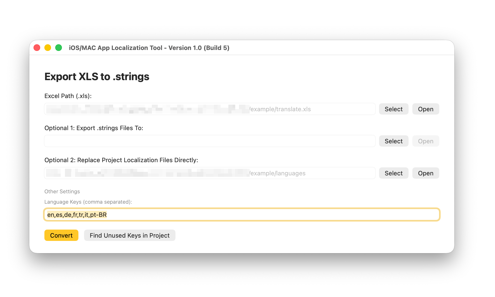
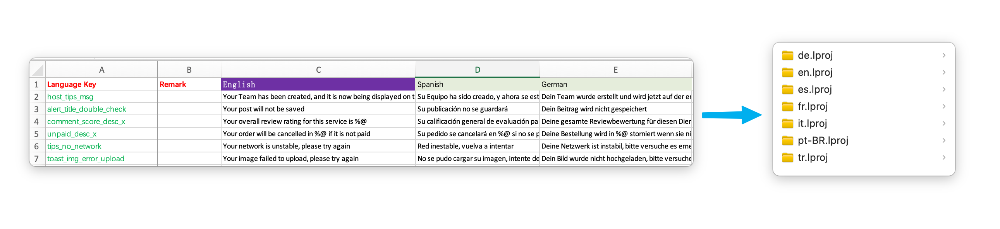

# XLSConvertToString

XLSConvertToString is a small macOS utility for converting localization tables in `.xls` format into Apple `.strings` files.

## What it does

- Converts one Excel `.xls` file into localized `.strings` output
- Supports exporting to a standalone folder of `*.strings` files
- Supports replacing `Localizable.strings` directly inside an existing project’s `<language>.lproj` folders
- Provides a helper tool to find unused localization keys in a source tree






## Excel format

The app expects the first worksheet in the workbook and uses the following column layout:

| Column | Meaning |
| --- | --- |
| 1 | Localization key |
| 2 | Note / comment column |
| 3+ | Translation columns, one column per language |

Notes:

- Empty key cells are skipped
- Empty translation cells are skipped
- Double quotes in values are escaped automatically
- Leading and trailing whitespace is trimmed before writing output

## Export modes

### 1. Export `.strings` files to a folder

The app writes one file per language key, for example:

- `en.strings`
- `es.strings`
- `de.strings`

Each file contains entries in the standard Apple format:

```text
"hello_key" = "Hello";
```

### 2. Replace project localization files directly

If you select a project localization directory, the app writes to:

- `<language>.lproj/Localizable.strings`

This is useful when you want to update an existing macOS or iOS project in place.

## Unused key search

The app also includes a scan tool for finding localization keys from the XLS file that are not referenced in source code.

It scans:

- `.m`
- `.h`
- `.swift`

Optional behavior:

- Ignore comments while scanning source files

The result panel lists the remaining unused keys and shows progress while the scan runs.

## Usage

1. Open the app in Xcode and run it as a macOS app.
2. Select an `.xls` file.
3. Choose either:
   - an output folder for `.strings` files, or
   - a project localization folder to update `<language>.lproj/Localizable.strings`
4. Enter the language keys in the same order as the translation columns in the spreadsheet.
5. Click **Convert**.

For example, if your spreadsheet uses these translation columns:

- `en`
- `es`
- `de`

Then the language keys field should be:

```text
en,es,de
```

## Build notes

- The project now vendors `libxls` source directly in `XLSConvertToString/Vendor/libxls` and builds it as part of the app target.
- This removes the previous Apple Silicon Rosetta dependency caused by the old `x86_64`-only `DHxlsReader` static library.
- The app now builds as a universal macOS binary (`arm64` + `x86_64`) on current Xcode versions.
- The code signing team identifier is intentionally not committed for open-source use. Set your own signing team locally if you want to archive or distribute the app.
- The bundle identifier is safe to change for your own release process if needed.

## License

Add your preferred license before publishing if you want the repository to be fully open-source ready.
